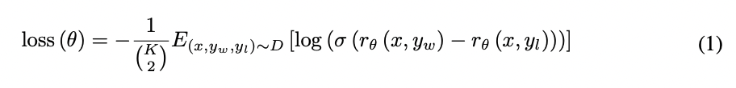

# Multinomal Reward

Train a reward model from your data using a single line of code!

Most reward model implementations only support being trained by comparing two options.
This repository implements a reward model that can be trained with >=2 options.
It also contains helper functions for passing data into the reward model.
This makes it easier to implement RLHF, which is necessary for open source models to 
reach the frontier of performance and alignment.

## Quick Start

You can see example usages of all the classes and methods in `train.py`, 
which replicates the reward model from _"Learning to summarize from human feedback"_ 
[(Stiennon et al., 2020)](https://arxiv.org/abs/2009.01325).

```bash
git clone git@github.com:withmartian/multinomial_reward.git
pip install -r requirements.txt
python train.py
```

## Using This Package

It's simple to get started with (you can train your own reward model with a single line of code), and extensible 
(so you can easily adapt it to more complex use cases).

This repo expects input to be provided in the following format:

```json
[
  {
    "prompt": "YOUR PROMPT HERE",
    "ranked_outputs": [
      "BEST OUTPUT",
      "SECOND BEST OUTPUT",
      "...",
      "WORST OUTPUT"
    ]
  }, ...
]
```

An example of this can be found in `/examples/reddit-tldr-train.json`, which contains the training data from
[(Stiennon et al., 2020)](https://arxiv.org/abs/2009.01325) in the correct format.

Then, `create_comparison_dataset`, `RankingDataset`, and `DataCollator` allow you to feed that form of output 
into the model. 

The `Model` can be instantiated using any huggingface T5 model, but only the encoder will be used.
(Support for other models, like LlaMa, coming soon.)

Both `Model` and `DataCollator` expect a `max_ranks_per_batch` parameter, which contains the largest
value of $K$ in any batch. This value should be the same for the `Model` and `DataCollator`. If `max_ranks_per_batch=2`, 
then the model will function as the classical binomial reward model.

## Why Multinomial Reward?

Most reward model implementations are "binomial" -- they can only be trained on a prompt and two ranked outputs.
But what if you have a dataset which ranks a larger number of outputs (for example, because your application generates
$K$ different outputs at once)?

You could try training the reward model on every pair, but that would lead to overfitting, and it would require you
to re-compute the reward for each pair. That means the training process would take O($K^2$) time.

A "multinomial" reward function is identical to a binomial reward function if $K=2$, but if $K>2$, it computes
the reward for all the ranked outputs from a prompt at once. This prevents overfitting and provides a much more
efficient $O(K)$ implementation.

## Todos and Limitations
- [ ] Update the reward model to use additional models (currently supports only T5Encoder models from huggingface)

## Technical Details (For Those Who Care)

_Warning, math ahead!_

This repo implements the following reward function from
_"Training language models to follow instructions with human feedback"_
[(Ouyang et al., 2022)](https://arxiv.org/abs/2203.02155):



If you have a prompt $x$ with two examples $y_w$ (the better example) and $y_l$ (the worse example), you can minimize 
the log probability that the better example is rated lower than the worse. 
(This is the $log(\sigma(\delta))$ in the above loss function.) However, if you rank $K$ examples for
a single prompt, and you treat all ${K \choose 2}$ possible pairs separately in this way, it leads to overfitting, 
due to correlations between the pairs.

The multinomial reward function computes the loss for all the examples of a given prompt $x$ at once by averaging the loss
across all the pairs. This prevents overfitting and also reduces the number of times that the rewards need to be 
computed from $O(K^2)$ to $O(K)$.

In the case that $K=2$, the multinomial loss function and the binomial loss function are identical.
So, you never need to use another loss function again. Not to hop on the Vaswani et al. bandwagon, but 
"this repo is all you need"!
